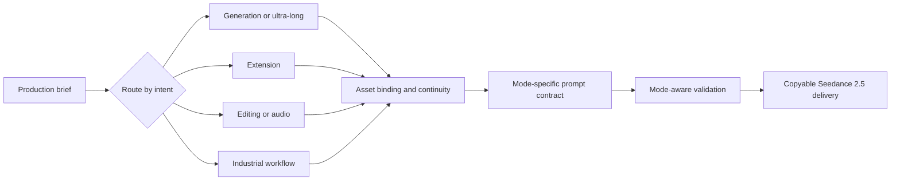

English | [中文](README.zh-CN.md) | [日本語](README.ja.md) | [한국어](README.ko.md) | [Español](README.es.md) | [Português](README.pt.md) | [Français](README.fr.md)

<p align="center">
  
</p>

<h1 align="center">Seedance 2.5 Shot Design</h1>

<p align="center"><strong>Mode-aware directing, prompt design, extension, and editing for Jimeng Seedance 2.5</strong></p>

<p align="center">
  
  
  
</p>

Seedance Shot Design turns a rough video idea or an approved source clip into a production-ready Seedance 2.5 plan and copyable prompt. Version 3.0 is a capability-level rewrite for 30-second standard generation, 30–180 second ultra-long work, multimodal references, extension, precision editing, and industrial workflows.

## What changed in 3.0

| Area | Seedance 2.5 behavior |
|---|---|
| Standard generation | One continuous 4–30s generation; exactly 30s stays in standard mode by default |
| Ultra-long | Continuous 30–180s stories with a continuity bible, acts, sequences, and a resolved ending |
| Extension | Source ≤30s, add 4–30s, final ≤60s; the prompt controls only the added portion |
| Multimodal input | Up to 30 images, 10 videos, and 10 audios under the documented per-type duration/file constraints |
| Editing | Smart edit, annotation-based advanced edit, local replacement/removal, and viewpoint reconstruction |
| Audio | Audio-only references, voice/timbre binding, multilingual dialogue, BGM removal with speech/ambience preservation |
| Production modes | Creative transfer, green screen, rough/fine white model, seamless transition, multi-panel storyboard |
| Validation | Mode-aware duration, asset, timeline, contract, preservation, and contradiction checks |
| Localization | Native directing language; dialogue is explicitly bound to speaker and target language |

The skill deliberately removes obsolete assumptions: no forced split above 15 seconds, no 9/3/3/12 mixed-file rule, no universal 500-character ceiling, no forced English for non-Chinese users, and no undocumented 1080p or CLI claims.

## What's new in 3.1

| Area | Enhancement |
|---|---|
| First-use onboarding | Automatic quick-start guide, minimum input template, and representative examples on first invocation |
| Official examples | Curated reference examples from official ByteDance / Dreamina documentation for structure anchoring |
| One-click install | `npx --yes skills@latest add` support alongside manual git clone |
| Timestamp-30s routing | Dedicated routing for exact 30-second videos requiring precise per-second timeline control |

## Core workflow



The skill:

1. infers the production brief;
2. selects one primary Seedance mode;
3. loads only the relevant reference guides;
4. binds every asset to a role, scope, and exclusion;
5. designs time, action causality, and continuity state;
6. validates and delivers one self-contained prompt.

## Supported routes

- `standard`: 全能参考 / 首尾帧, 4–30s
- `ultra_long`: 超长视频, 30–180s
- `extension`: 视频延长
- `smart_edit` / `advanced_edit`: 智能编辑 / 高级编辑 / 视频编辑
- `viewpoint`: 空间视角修改
- `bgm`: 音轨编辑 / BGM separation
- `creative_transfer`: 迁移创意
- `green_screen`: 绿幕编辑
- `rough_white_model` / `fine_white_model`: 粗颗粒 / 细颗粒白模
- `seamless_transition`: 视频无缝转场
- `storyboard`: 多宫格分镜

## Installation

Place this folder in the skills directory used by your agent host. Common examples:

```text
.claude/skills/seedance-shot-design/
~/.codex/skills/seedance-shot-design/
.cursor/skills/seedance-shot-design/
```

### Quick install (recommended)

With Node.js installed:

```bash
npx --yes skills@latest add woodfantasy/Seedance-ShotDesign-Skills -g -y
```

### Manual install

The repository currently remains available at its existing URL:

```bash
git clone https://github.com/woodfantasy/Seedance-ShotDesign-Skills.git seedance-shot-design
```

Invoke it explicitly when desired:

```text
Use $seedance-shot-design to design a continuous 30-second vertical suspense film.
```

It can also activate implicitly for Seedance prompts, storyboards, extension, editing, white-model rendering, green-screen compositing, and related shot-design requests.

## Example requests

```text
Create a 30-second 9:16 product story with three image references and one voice reference.
```

```text
Continue @Video1 forward by 20 seconds from its last-frame motion, without changing the original clip.
```

```text
Remove the poster inside the red box from 4–11s, reconstruct the brick wall, then remove BGM while keeping dialogue and footsteps.
```

```text
Render this 24-second fine white-model animation as a realistic sci-fi hangar while preserving geometry, camera, and collision timing.
```

## Validator

The standard library–only validator can be used locally or in CI:

```bash
python3 scripts/validate_prompt.py \
  --mode standard \
  --duration 30 \
  --resolution 720p \
  --prompt-file prompt.txt
```

For extension, `--duration` means the **added** duration:

```bash
python3 scripts/validate_prompt.py \
  --mode extension \
  --duration 20 \
  --source-duration 25 \
  --prompt-file extension.txt
```

Run the regression suite:

```bash
python3 -m unittest scripts/test_validate.py
```

## Structure

```text
seedance-shot-design/
├── SKILL.md
├── agents/openai.yaml
├── assets/logo.svg
├── references/
│   ├── seedance-specs.md
│   ├── workflow-router.md
│   ├── prompt-contracts.md
│   ├── long-form-storytelling.md
│   ├── multimodal-references.md
│   ├── video-editing.md
│   ├── industrial-workflows.md
│   ├── cinematography.md
│   ├── quality-anchors.md
│   ├── micro-expressions.md
│   ├── audio-tags.md
│   ├── director-styles.md
│   ├── scenarios.md
│   ├── failure-diagnosis.md
│   ├── first-use-onboarding.md
│   └── official-examples.md
└── scripts/
    ├── validate_prompt.py
    └── test_validate.py
```

## Platform notes

- The supplied Seedance 2.5 manual documents 480p and 720p output. `720P+` appears as a UI label, not a separately documented parameter. Verify the current UI before promising anything beyond 720p.
- Stability guidance is reported as a warning, not confused with a hard upload limit.
- Prompt syntax uses the exact asset tokens shown by the user's interface, such as `@图片1`, `@视频1`, and `@音频1`.
- Recognizable living-person likeness, brands, copyrighted characters, and sensitive content still require appropriate authorization and platform-policy compliance.
- The skill designs and validates prompts; it does not submit a generation job or consume platform credits.

## License

[MIT-0](LICENSE)
