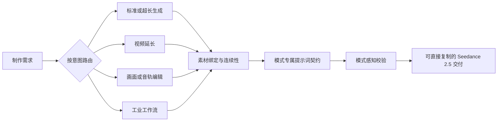

[English](README.md) | 中文 | [日本語](README.ja.md) | [한국어](README.ko.md) | [Español](README.es.md) | [Português](README.pt.md) | [Français](README.fr.md)

<p align="center">
  
</p>

<h1 align="center">Seedance 2.5 Shot Design</h1>

<p align="center"><strong>面向即梦 Seedance 2.5 的模式感知导演、提示词、延长与编辑技能</strong></p>

<p align="center">
  
  
  
</p>

Seedance Shot Design 能把模糊创意或已经确认的源视频，转化为可直接用于 Seedance 2.5 的制作方案和完整提示词。3.0 版本是一次能力级重写，覆盖标准 30 秒生成、30–180 秒超长视频、多模态参考、视频延长、精确编辑与工业化工作流。

## 3.0 更新重点

| 能力 | Seedance 2.5 适配 |
|---|---|
| 标准生成 | 单次连续生成 4–30 秒；恰好 30 秒默认保留在标准模式 |
| 超长视频 | 连续生成 30–180 秒，通过连续性 Bible、幕、序列和闭合结尾控制 |
| 视频延长 | 源视频 ≤30 秒，新增 4–30 秒，最终 ≤60 秒；提示词只作用于新增部分 |
| 多模态输入 | 图片最多 30 张、视频最多 10 个、音频最多 10 个，并按类型校验格式与总时长 |
| 视频编辑 | 智能编辑、高级标注编辑、局部替换/移除、空间视角重建 |
| 音频能力 | 纯音频参考、音色绑定、多语言对白、移除 BGM 并保留对白/环境音 |
| 工业工作流 | 迁移创意、绿幕、粗/细颗粒白模、无缝转场、多宫格分镜 |
| 自动校验 | 按模式检查时长、素材、时间轴、编辑契约、保留项与直接冲突 |
| 本地化 | 使用用户的自然工作语言；每句对白绑定角色、语言和字幕状态 |

技能已移除会导致 2.5 输出错误的旧假设：不再把超过 15 秒的任务强制拆段，不再使用 9/3/3/12 混合素材上限，不再强制 500 字符上限，不再把非中文请求统一翻成英文，也不再宣称手册未确认的 1080p 或 CLI 能力。

## 3.1 新增

| 能力 | 说明 |
|---|---|
| 首次使用引导 | 首次调用时自动展示快速入门、最小输入模板和代表性示例 |
| 官方示例参考 | 收录来自字节跳动 / 即梦官方文档的结构参考示例 |
| 一键安装 | 支持 `npx --yes skills@latest add` 一键安装，同时保留手动 git clone |
| 精确时间轴路由 | 为恰好 30 秒且需要逐秒时间轴控制的任务增加专用路由 |

## 核心工作流



技能会依次：

1. 提取制作目标、时长、画幅、素材和声音要求；
2. 选择一个主模式，避免把生成、延长和编辑混为一谈；
3. 只加载当前任务需要的参考规范；
4. 为每个素材绑定用途、时间范围与禁止迁移内容；
5. 设计动作因果、时间轴和跨镜连续状态；
6. 校验后交付一份无需用户自行拼接的完整提示词。

## 支持模式

- `standard`：全能参考 / 首尾帧，4–30 秒
- `ultra_long`：超长视频，30–180 秒
- `extension`：视频延长
- `smart_edit` / `advanced_edit`：智能编辑 / 高级编辑 / 视频编辑
- `viewpoint`：空间视角修改
- `bgm`：音轨编辑 / BGM 分离
- `creative_transfer`：迁移创意
- `green_screen`：绿幕编辑
- `rough_white_model` / `fine_white_model`：粗颗粒 / 细颗粒白模
- `seamless_transition`：视频无缝转场
- `storyboard`：多宫格分镜

## 安装

把本文件夹放到所使用 Agent 的技能目录中。常见位置：

```text
.claude/skills/seedance-shot-design/
~/.codex/skills/seedance-shot-design/
.cursor/skills/seedance-shot-design/
```

### 推荐：一行安装

已安装 Node.js 的用户：

```bash
npx --yes skills@latest add woodfantasy/Seedance-ShotDesign-Skills -g -y
```

### 手动安装

仓库目前仍沿用原地址：

```bash
git clone https://github.com/woodfantasy/Seedance-ShotDesign-Skills.git seedance-shot-design
```

需要时可明确调用：

```text
请使用 $seedance-shot-design 设计一支连续 30 秒的竖屏悬疑短片。
```

Seedance 提示词、分镜、延长、编辑、白模渲染、绿幕合成等请求也可以隐式触发。

## 请求示例

```text
做一支 30 秒 9:16 产品故事，使用三张图片和一段音色参考。
```

```text
把 @视频1 从尾帧动作向后延长 20 秒，原视频不能改变。
```

```text
移除 4–11 秒红框内的海报并补全砖墙，再去掉 BGM，保留对白和脚步。
```

```text
把 24 秒细颗粒白模渲染为写实科幻机库，保持几何、机位和碰撞时序。
```

## 校验器

校验器只依赖 Python 标准库，可用于本地或 CI：

```bash
python3 scripts/validate_prompt.py \
  --mode standard \
  --duration 30 \
  --resolution 720p \
  --prompt-file prompt.txt
```

视频延长的 `--duration` 指**新增时长**：

```bash
python3 scripts/validate_prompt.py \
  --mode extension \
  --duration 20 \
  --source-duration 25 \
  --prompt-file extension.txt
```

运行回归测试：

```bash
python3 -m unittest scripts/test_validate.py
```

## 目录结构

```text
seedance-shot-design/
├── SKILL.md
├── agents/openai.yaml
├── assets/logo.svg
├── references/
│   ├── seedance-specs.md
│   ├── workflow-router.md
│   ├── prompt-contracts.md
│   ├── long-form-storytelling.md
│   ├── multimodal-references.md
│   ├── video-editing.md
│   ├── industrial-workflows.md
│   ├── cinematography.md
│   ├── quality-anchors.md
│   ├── micro-expressions.md
│   ├── audio-tags.md
│   ├── director-styles.md
│   ├── scenarios.md
│   ├── failure-diagnosis.md
│   ├── first-use-onboarding.md
│   └── official-examples.md
└── scripts/
    ├── validate_prompt.py
    └── test_validate.py
```

## 平台说明

- 当前使用手册明确列出 480p 与 720p 输出；`720P+` 是界面标签，不应直接解释成独立的 1080p 参数。承诺更高分辨率前请检查当前界面。
- 稳定性建议会作为警告提示，不会被误当成平台硬限制。
- 提示词保留用户界面中的原始素材 token，例如 `@图片1`、`@视频1` 和 `@音频1`。
- 可识别真人、品牌、版权角色和敏感内容仍需获得适当授权并遵守平台政策。
- 本技能只负责设计与校验提示词，不会自动提交生成任务或消耗平台积分。

## 协议

[MIT-0](LICENSE)
